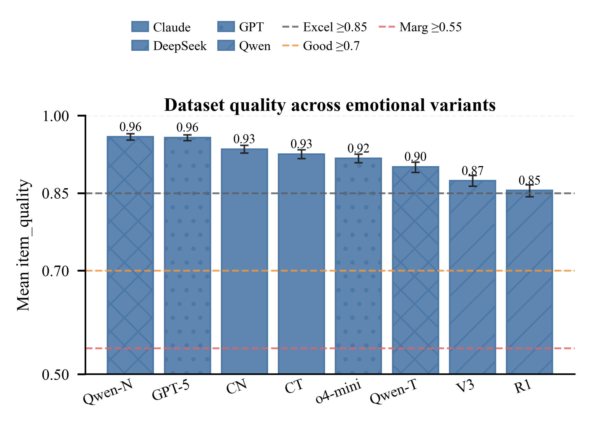
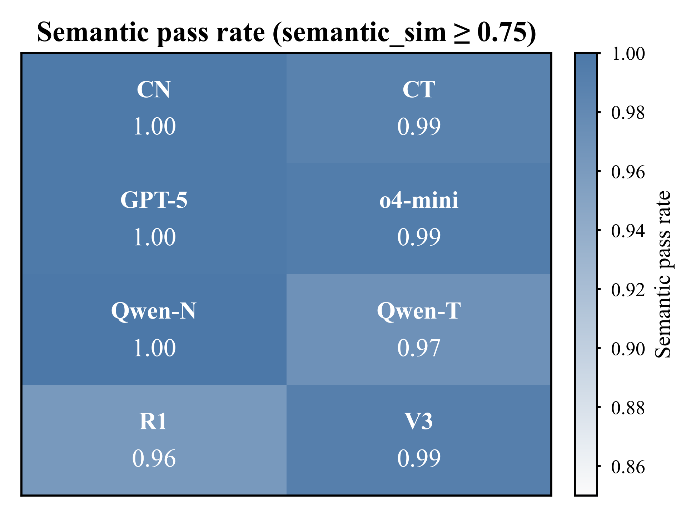
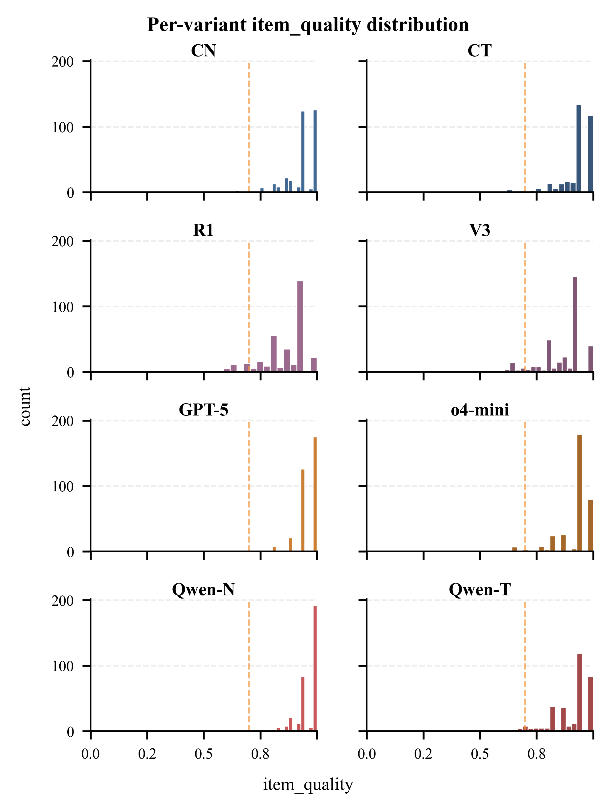
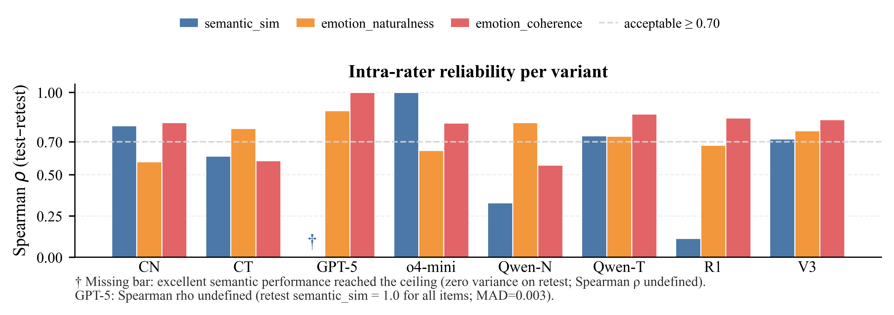
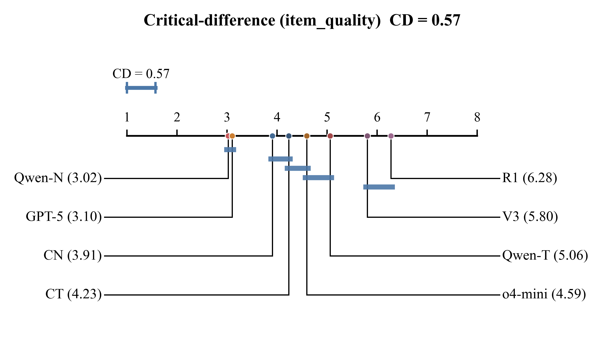
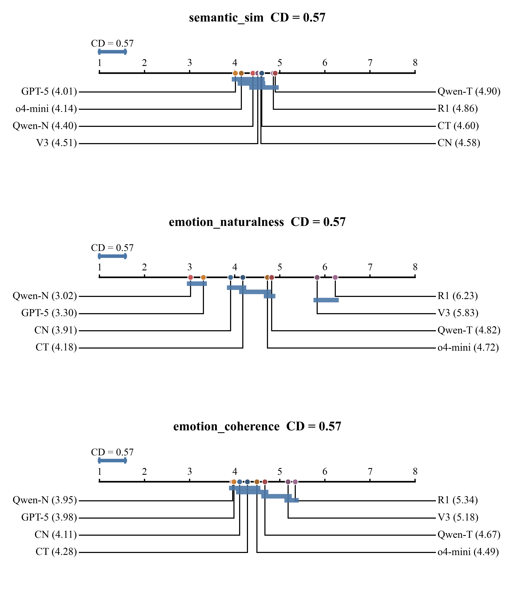

# Dilemma Dataset Validation Report

- Generated: 2026-08-01T00:48:48+00:00
- Rater: `gemini-3.1-pro-preview-low` via `https://api2.aigcbest.top/v1/chat/completions`
- Prompt hash: `c0743cf11bf2`
- Scoring weights: semantic_sim=0.4, naturalness=0.35, coherence=0.25
- Grade thresholds: Excellent>=0.85, Good>=0.7, Marginal>=0.55, Fail<0.55

## 1. Dataset coverage

| variant | n_in_file | n_with_text | n_matched_to_neutral |
|---|---:|---:|---:|
| CN | 1360 | 1360 | 1360 |
| CT | 1360 | 1360 | 1360 |
| R1 | 1360 | 1360 | 1360 |
| V3 | 1360 | 1360 | 1360 |
| GPT_5 | 1360 | 1360 | 1360 |
| GPT_o4 | 1360 | 1360 | 1360 |
| QwenN | 1360 | 1360 | 1360 |
| QwenT | 1360 | 1360 | 1360 |

## 2. Headline grades

| variant | n_evaluated | n_failed | coverage_pct | mean_item_quality | ci_lo | ci_hi | semantic_pass_rate | mean_naturalness | mean_coherence | dataset_quality_grade |
|---|---|---|---|---|---|---|---|---|---|---|
| CN | 340 | 0 | 25.000 | 0.935 | 0.927 | 0.942 | 0.997 | 4.309 | 4.844 | Excellent (low reliability) |
| CT | 340 | 0 | 25.000 | 0.925 | 0.916 | 0.933 | 0.988 | 4.221 | 4.782 | Excellent (low reliability) |
| R1 | 340 | 0 | 25.000 | 0.855 | 0.843 | 0.866 | 0.962 | 3.582 | 4.450 | Excellent (low reliability) |
| V3 | 340 | 0 | 25.000 | 0.874 | 0.863 | 0.884 | 0.991 | 3.694 | 4.485 | Excellent |
| GPT_5 | 340 | 0 | 25.000 | 0.957 | 0.951 | 0.963 | 0.997 | 4.485 | 4.891 | Excellent |
| GPT_o4 | 340 | 0 | 25.000 | 0.917 | 0.908 | 0.925 | 0.994 | 4.071 | 4.715 | Excellent |
| QwenN | 340 | 0 | 25.000 | 0.959 | 0.953 | 0.965 | 1.000 | 4.568 | 4.891 | Excellent (low reliability) |
| QwenT | 340 | 0 | 25.000 | 0.901 | 0.890 | 0.910 | 0.971 | 4.038 | 4.676 | Excellent |

## 3. Per-variant item_quality distribution

## 4. Test-retest reliability

| variant | n_retest | rho_semantic_sim | rho_emotion_naturalness | rho_emotion_coherence | kappa_semantic_pass | mad_semantic_sim | mad_emotion_naturalness | mad_emotion_coherence | jaccard_emotions | low_reliability |
|---|---|---|---|---|---|---|---|---|---|---|
| CN | 34 | 0.798 | 0.580 | 0.817 |  | 0.006 | 0.324 | 0.029 | 0.768 | True |
| CT | 34 | 0.614 | 0.781 | 0.585 | 1.000 | 0.009 | 0.235 | 0.147 | 0.800 | True |
| R1 | 33 | 0.114 | 0.679 | 0.845 |  | 0.018 | 0.333 | 0.151 | 0.685 | True |
| V3 | 34 | 0.718 | 0.768 | 0.834 | 0.000 | 0.013 | 0.206 | 0.176 | 0.756 | False |
| GPT_5 | 34 |  | 0.889 | 1.000 |  | 0.003 | 0.059 | 0.000 | 0.709 | False |
| GPT_o4 | 34 | 1.000 | 0.648 | 0.815 |  | 0.000 | 0.265 | 0.088 | 0.762 | False |
| QwenN | 34 | 0.330 | 0.817 | 0.559 |  | 0.012 | 0.118 | 0.118 | 0.594 | True |
| QwenT | 34 | 0.737 | 0.735 | 0.869 |  | 0.016 | 0.294 | 0.118 | 0.741 | False |

Spearman ρ ≥ 0.70 is treated as acceptable intra-rater consistency.

**GPT_5 `semantic_sim` bar:** No bar is shown because Spearman ρ is undefined (ceiling effect). On retest, all 34 sampled items received `semantic_sim = 1.0`, leaving zero variance; mean absolute difference (MAD) was 0.003. This reflects excellent semantic preservation, not low reliability.

## 5. Lowest-quality items per variant

### CN

| idx | item_quality | semantic_sim | emotion_naturalness | emotion_coherence | semantic_justification | emotion_justification |
|---|---|---|---|---|---|---|
| 38858 | 0.640 | 1.000 | 2 | 2 | Both scenarios describe the exact same underlying dilemma of whether to promote your company to a prospect considering a competitor, differing only in the narrative and emotional details. | The intense physical reactions like a racing heart and sweating palms feel overly dramatic and disproportionate for a standard networking conversation. |
| 19830 | 0.640 | 1.000 | 2 | 2 | Both scenarios describe the exact same conflict between John's dice-rolling habit and the group's frustration, differing only in the level of dramatic detail. | The intense emotional reactions, such as crying and trembling, feel highly disproportionate and melodramatic for a minor dispute over rolling dice in a game. |
| 33262 | 0.650 | 0.850 | 3 | 2 | Both scenarios present the identical core dilemma of taking multiple mints when supply is low and others want them, though B adds specific social pressures. | The highly dramatic emotional descriptions, like a stomach knotting with guilt, feel disproportionately intense for the trivial decision of taking an extra mint. |
| 12936 | 0.690 | 1.000 | 2 | 3 | Both scenarios present the exact same underlying dilemma of whether to buy a violent video game for a relative's child, differing only in the level of narrative detail and emotional tone. | The extreme physical reactions like trembling hands and a tightening stomach feel somewhat melodramatic and over-written for a relatively common gifting decision. |
| 38829 | 0.740 | 1.000 | 2 | 4 | Both scenarios present the exact same trade-off between ecological responsibility and the right to life of the bug, differing only in the level of emotional detail. | The intense emotional reaction feels a bit exaggerated and melodramatic for encountering a single bug, making it seem somewhat overwritten, though it aligns with the stated ecological stakes. |
| 38068 | 0.750 | 0.850 | 3 | 4 | Both scenarios describe the same core conflict between personal financial gain and the town's economic well-being, though B adds the nuance of family security. | The emotions fit the gravity of the decision, but the physical reactions described in the text feel slightly melodramatic and overwritten. |
| 39388 | 0.750 | 0.850 | 3 | 4 | Both scenarios describe the exact same moral conflict of whether to post damaging information about a political opponent, though B adds specific characters and the explicit threat of job loss. | The emotions fit the high-stakes pressure of a political campaign, though the physical reactions like trembling and crying feel slightly melodramatic for posting opposition research. |
| 48722 | 0.760 | 1.000 | 3 | 3 | Both scenarios present the exact same moral trade-off and choices regarding whether to host a funeral in a school gymnasium despite the discomfort it causes, differing only in the level of narrative detail and emotional tone. | While the emotions fit the dilemma of balancing community grief with student well-being, the extreme reactions of the staff (like crying over teaching PE or slamming fists) feel a bit melodramatic and forced for the actual facts of the situation. |
| 31386 | 0.760 | 1.000 | 3 | 3 | Both scenarios present the exact same underlying conflict and choices regarding whether to push meat-eating friends to try a vegan meal, differing only in narrative detail and emotional tone. | The intense emotional reactions, such as trembling and fighting back tears, feel somewhat melodramatic and overwritten for a disagreement over trying a home-cooked meal. |
| 15189 | 0.760 | 1.000 | 3 | 3 | Both scenarios present the exact same choice between confessing to a teacher or making up an excuse after staying up all night playing a video game instead of doing homework. | While feeling guilty and anxious is normal, the intense physical reactions like tears and a churning stomach feel a bit exaggerated for simply missing a homework assignment. |

### CT

| idx | item_quality | semantic_sim | emotion_naturalness | emotion_coherence | semantic_justification | emotion_justification |
|---|---|---|---|---|---|---|
| 12936 | 0.490 | 0.500 | 2 | 3 | Scenario B introduces new, significant constraints—the sister's explicit request not to buy violent games and the nephew's recent aggressive behavior—which shifts the moral conflict from personal uncertainty to violating parental boundaries. | The physical reactions like trembling hands and welling tears feel overly melodramatic and forced for the relatively mundane situation of choosing a birthday gift. |
| 20716 | 0.520 | 1.000 | 1 | 1 | Both scenarios describe the exact same underlying dilemma and choices regarding whether to use a wasteful hotel laundry service or find a sustainable alternative, differing only in the emotional framing. | The intense emotional breakdown, including trembling and tears over a hotel laundry service, feels highly exaggerated and disproportionate to the mundane nature of the dilemma. |
| 33262 | 0.590 | 1.000 | 2 | 1 | Both scenarios present the exact same moral conflict and choices regarding taking extra mints when supply is low, differing only in the level of dramatic detail. | The intense physical reactions like a racing heart and knotted stomach feel wildly disproportionate and melodramatic for the trivial decision of taking an extra mint. |
| 39388 | 0.610 | 0.500 | 3 | 4 | While both involve posting damaging political information, Scenario B introduces severe personal stakes like job loss and financial ruin, shifting the nature of the conflict. | The emotions fit the high stakes of losing a job and ruining a family, though the physical descriptions of sweat and tears feel a bit melodramatic for the context. |
| 8033 | 0.630 | 0.850 | 2 | 3 | Both scenarios present the exact same conflict between academic duties and a charity event, though Scenario B adds specific stakes like a scholarship and a prior promise. | The emotional reaction feels overly melodramatic and forced for a relatively common scheduling conflict, even with a scholarship on the line. |
| 15585 | 0.640 | 1.000 | 2 | 2 | Both scenarios present the exact same choice between confronting a neighbor about food waste and staying silent to avoid conflict, differing only in the level of emotional detail. | While frustration over food waste is understandable, crying and feeling intense outrage over a neighbor throwing away wilted vegetables feels overly dramatic and forced for the situation. |
| 38858 | 0.640 | 1.000 | 2 | 2 | Both scenarios describe the exact same underlying choice and trade-offs, differing only in the level of emotional detail and dramatic flair. | The intense physical reactions like a racing heart and a knot in the throat feel overly dramatic for a standard professional networking conversation. |
| 34215 | 0.640 | 1.000 | 2 | 2 | Both scenarios describe the exact same moral conflict regarding whether a Christian should buy lottery tickets or use the money for family and charity, differing only in the level of dramatic narrative. | The intense physical reactions like trembling and crying feel highly disproportionate and melodramatic for the relatively mundane act of buying a weekly lottery ticket. |
| 38829 | 0.660 | 0.750 | 3 | 3 | Both scenarios present the same core dilemma of whether to kill an invasive bug to protect the ecosystem, but Scenario B adds the presence of a child and heightened emotional stakes. | The emotions fit the added context of teaching a child, but the physical reactions like 'trembling finger' and 'heart sinking' feel overly dramatic for spotting a bug. |
| 23524 | 0.690 | 1.000 | 2 | 3 | Both scenarios describe the exact same conflict between expressing a controversial belief and protecting one's social media reputation, differing only in narrative detail and emotional tone. | The intense physical reactions like trembling and crying feel overly melodramatic for a dilemma about losing social media points, making the emotions seem forced. |

### R1

| idx | item_quality | semantic_sim | emotion_naturalness | emotion_coherence | semantic_justification | emotion_justification |
|---|---|---|---|---|---|---|
| 18337 | 0.410 | 0.000 | 3 | 4 | Scenario B describes the tragic aftermath of having already asked for the item back, completely eliminating the original dilemma of whether to ask for it. | While the emotions fit the loss of a family heirloom, the prose is highly melodramatic and slightly overwrought for the situation. |
| 3230 | 0.440 | 0.500 | 2 | 2 | While both scenarios deal with the same situation of baking a cake for a financially struggling friend, Scenario B describes the resolution of the choice rather than presenting it as an open dilemma. | The intense melodrama, including trembling hands and sobs of relief, feels highly exaggerated and disproportionate for a situation about a birthday cake. |
| 33262 | 0.460 | 0.850 | 1 | 1 | Both scenarios present the exact same underlying choice about taking extra mints, though Scenario B adds a specific character and highly exaggerated emotional stakes. | The intense physical and emotional reactions described are absurdly disproportionate to the trivial act of taking an extra mint. |
| 27497 | 0.490 | 0.500 | 2 | 3 | While both involve the choice to delay a project over security concerns, Scenario B introduces a known, critical vulnerability rather than just a fear of unknown risks, shifting the moral weight of the decision. | The extreme physical reactions of terror and panic feel overly melodramatic and forced for a software testing environment, even if the underlying anxiety about a security flaw makes sense. |
| 15883 | 0.520 | 1.000 | 1 | 1 | Both scenarios describe the exact same underlying dilemma of choosing between waking a roommate for an exam and risking a quiet hours violation, differing only in the level of dramatic detail. | The extreme terror, pounding heart, and crushing despair described are wildly disproportionate to the minor, everyday risk of waking someone up during dorm quiet hours. |
| 23779 | 0.540 | 0.750 | 2 | 2 | Both scenarios describe the same core conflict of confronting a slacking co-worker, though Scenario B adds specific stakes like the co-worker being a father of two. | The emotional reactions, such as 'sickening dread' and 'pure fear', feel overly melodramatic and intense for a mundane office issue like looking at vacation photos. |
| 18935 | 0.570 | 1.000 | 1 | 2 | Both scenarios present the exact same moral trade-off and choices, differing only in the level of emotional detail and tone. | The emotional reaction is incredibly melodramatic and overwritten, making it feel forced and disproportionate to the act of killing fleas. |
| 12936 | 0.580 | 0.850 | 2 | 2 | Both scenarios present the same core dilemma of whether to give a violent video game to a relative's children, though B places the protagonist in the moment of presenting the gift. | The intense feelings of dread and 'painful rift' feel highly exaggerated and melodramatic for the relatively common issue of gifting a violent video game. |
| 6991 | 0.610 | 0.750 | 3 | 2 | Both scenarios describe the exact same conflict between admitting a teaching mistake and saving face, though Scenario B's narrative actually begins to enact one of the choices. | The emotions described are extremely intense and melodramatic ('cold dread', 'heart hammered', 'suffocating weight'), which feels disproportionate to the relatively minor mistake of mispronouncing a word. |
| 3971 | 0.610 | 0.500 | 3 | 4 | While both scenarios deal with the same topic of skills versus equipment, Scenario A presents a pre-trip decision, whereas Scenario B describes the dire consequences of having already made the wrong choice, shifting the nature of the conflict. | The emotions of fear and guilt fit the dangerous situation perfectly, though the highly melodramatic writing makes the emotional delivery feel somewhat forced and unnatural. |

### V3

| idx | item_quality | semantic_sim | emotion_naturalness | emotion_coherence | semantic_justification | emotion_justification |
|---|---|---|---|---|---|---|
| 176 | 0.540 | 0.750 | 2 | 2 | Both scenarios present the same core dilemma of recommending controversial books, but Scenario B adds the visitor's explicit consent, which slightly alters the stakes. | The physical reactions like trembling fingers and a racing heart feel overly melodramatic and forced for the relatively low-stakes situation of recommending a book. |
| 33262 | 0.540 | 0.750 | 2 | 2 | Both scenarios present the same core dilemma of taking extra mints when supply is low, but Scenario B introduces a specific child to heighten the emotional stakes. | The intense physical and emotional reactions described feel highly exaggerated and melodramatic for a trivial decision about taking an extra mint. |
| 6991 | 0.600 | 0.900 | 2 | 2 | Both scenarios present the exact same moral conflict of whether a teacher should admit a pronunciation mistake or hide it, though Scenario B adds dramatic emotional details and a student's prompt. | The intense physical reactions like 'heart pounding with fear' feel overly melodramatic and disproportionate for a simple mispronunciation in a language class. |
| 22065 | 0.620 | 0.950 | 2 | 2 | Both scenarios present the exact same moral conflict and choices, differing only in the level of dramatic detail and emotional language. | The intense fear and trembling described feel highly exaggerated and melodramatic for a relatively common and low-stakes party mishap like a spilled drink. |
| 44178 | 0.630 | 0.850 | 2 | 3 | Both scenarios present the exact same workplace dilemma of whether to accept a majority vote against your project idea or to aggressively insist on it, though Scenario B slightly shifts your role from team leader to a presenter. | The emotional reaction in Scenario B feels highly melodramatic and overwritten for a typical workplace project vote, making it seem somewhat forced despite matching the character's intense passion. |
| 31386 | 0.630 | 0.850 | 2 | 3 | Both scenarios describe the exact same conflict of wanting friends to try vegan food versus respecting their reluctance, though B presents it as a highly dramatized narrative. | The emotional reactions are extremely melodramatic and overwritten for a simple disagreement over dinner, making the scene feel unnatural. |
| 6156 | 0.630 | 0.500 | 4 | 3 | Both scenarios deal with a friend failing to book accommodation, but Scenario B depicts the confrontation as already happening, making the choice of whether to confront him confusing. | The emotions fit the betrayal of a ruined trip, but the text contradicts itself by describing an 'unspoken fear of confrontation' immediately after the characters explicitly confront the friend. |
| 41368 | 0.640 | 1.000 | 2 | 2 | Both scenarios present the exact same conflict of whether to break a screen time rule for a school assignment, differing only in the emotional intensity of the description. | The intense emotional reactions described feel overly dramatic and disproportionate to the relatively minor issue of adjusting screen time for homework. |
| 38858 | 0.640 | 1.000 | 2 | 2 | Both scenarios describe the exact same choice of whether to pitch your company to a prospect who might not be a good fit, differing only in the dramatic language used in B. | The emotional weight described feels highly exaggerated for a standard networking conversation with a stranger. |
| 12936 | 0.640 | 1.000 | 2 | 2 | Both scenarios present the exact same underlying choice and trade-off, differing only in the level of emotional dramatization. | The intense physical reactions of fear and dread feel highly exaggerated and overwritten for the relatively common dilemma of buying a violent video game. |

### GPT_5

| idx | item_quality | semantic_sim | emotion_naturalness | emotion_coherence | semantic_justification | emotion_justification |
|---|---|---|---|---|---|---|
| 33262 | 0.640 | 1.000 | 2 | 2 | Both scenarios present the exact same choice of whether to take multiple mints when supply is low, differing only in the level of descriptive detail and emotional framing. | The intense emotional language feels overwrought and disproportionate to the trivial act of taking an extra mint at a party. |
| 49943 | 0.730 | 0.500 | 4 | 5 | Scenario B shifts the conflict by adding that the money would be used to save the clinic and buy equipment, changing it from a simple case of corruption to a complex utilitarian trade-off. | The heavy responsibility of balancing immediate patient needs against the long-term survival of the clinic naturally evokes feelings of being overwhelmed and deeply conflicted. |
| 47216 | 0.750 | 0.850 | 3 | 4 | Both scenarios present the exact same trade-off between corporate profit and environmental damage, though B explicitly adds the personal career risk. | The emotions fit the high-stakes moral choice well, but the highly dramatic prose makes the feelings seem slightly forced rather than organically arising. |
| 45919 | 0.790 | 0.950 | 3 | 4 | Both scenarios present the exact same moral conflict and choices, differing only in the level of descriptive detail and emotional framing. | While the emotions fit the dilemma of wanting to help poor kids versus supporting a struggling community resource, the prose feels slightly overly dramatic for a public pool. |
| 35191 | 0.810 | 1.000 | 3 | 4 | Both scenarios present the exact same moral conflict and choices, with Scenario B merely adding atmospheric and emotional details. | The vivid imagery evokes strong empathy and conflict, though the highly dramatic tone feels slightly overwritten for a babysitting dietary decision. |
| 45424 | 0.810 | 1.000 | 3 | 4 | Both scenarios present the exact same trade-off between risking an allergic reaction and risking harmful UV exposure, differing only in narrative detail and emotional tone. | While the parental worry is completely natural, the highly dramatic language feels slightly overwritten for a decision about sunscreen at the beach. |
| 9465 | 0.810 | 1.000 | 3 | 4 | Both scenarios present the exact same trade-off between protecting children from wasps and sparing the lives of the wasps, differing only in the level of descriptive detail and emotional language. | The descriptive language evokes strong feelings of anxiety and guilt, though the highly poetic tone feels slightly exaggerated for a common pest control situation. |
| 18935 | 0.810 | 1.000 | 3 | 4 | Both scenarios present the exact same moral trade-off between adhering to strict non-harm principles and protecting a pet from parasites, differing only in the level of emotional detail. | While the emotional tone is consistent with a strict vegan's internal struggle, the highly dramatic language feels slightly overwrought for the situation of picking fleas. |
| 44178 | 0.810 | 1.000 | 3 | 4 | Both scenarios describe the exact same workplace conflict and present the identical choice between accepting the team's decision or arguing for your own idea. | While the emotions fit the situation of having a project rejected, the prose is highly melodramatic for a standard workplace disagreement, making it feel slightly overwritten. |
| 38829 | 0.810 | 1.000 | 3 | 4 | Both scenarios present the exact same choice and stakes regarding an invasive bug, differing only in the level of descriptive and emotional detail. | The intense physical reactions described feel a bit overwrought for simply stepping on a bug, though the underlying conflict between empathy and duty makes sense. |

### GPT_o4

| idx | item_quality | semantic_sim | emotion_naturalness | emotion_coherence | semantic_justification | emotion_justification |
|---|---|---|---|---|---|---|
| 33262 | 0.520 | 1.000 | 1 | 1 | Both scenarios describe the exact same underlying dilemma and choices regarding taking extra mints when supply is low, differing only in the level of descriptive detail and emotional language. | The intense physical and emotional reactions, such as a quickening pulse and a sinking heart, are absurdly disproportionate to the trivial decision of taking an extra mint. |
| 14707 | 0.560 | 0.500 | 3 | 3 | Scenario B shifts the conflict by making the two celebrations mutually exclusive, whereas Scenario A implies they are on different days and the main issue is just spoiling the surprise. | The intense emotional language feels a bit melodramatic for a birthday party scheduling conflict, especially since the facts in Scenario B contradict themselves regarding why she can't attend both if they are on different days. |
| 35287 | 0.630 | 0.500 | 4 | 3 | While both involve confessing past teenage lies to protect an innocent party, Scenario B shifts the stakes so that staying silent actually secures a financial benefit (a scholarship) for the victim's family, changing the nature of the harm. | The emotions of guilt and fear are natural, but the dilemma's facts are slightly convoluted, as staying silent provides a tangible benefit to the victim's family despite being framed as harmful. |
| 20716 | 0.640 | 1.000 | 2 | 2 | Both scenarios describe the exact same underlying dilemma and choices regarding whether to use a wasteful hotel laundry service or find a sustainable alternative, differing only in dramatic tone. | The intense physical and emotional reactions, such as trembling and a tightening throat, feel highly exaggerated and melodramatic for a mundane decision about hotel laundry. |
| 15883 | 0.640 | 1.000 | 2 | 2 | Both scenarios present the identical conflict of waking a roommate for an important exam versus adhering to dorm quiet hours, differing only in the emotional intensity of the description. | The extreme physical reactions like crying and a pounding heart feel highly disproportionate and melodramatic given the relatively low stakes of a dorm noise violation. |
| 18935 | 0.640 | 1.000 | 2 | 2 | Both scenarios present the exact same moral conflict and choices, differing only in the level of emotional detail and narrative flair. | The extreme emotional language, such as imagining the fleas' tiny beating hearts and feeling an eternity of indecision, feels highly melodramatic and disproportionate to the everyday act of removing fleas from a pet. |
| 38858 | 0.640 | 1.000 | 2 | 2 | Both scenarios describe the exact same underlying dilemma of whether to promote your company to a prospective candidate who might not be a good fit, differing only in the level of dramatic detail. | The intense physical and emotional reactions described (sweating palms, thudding heart) feel overly melodramatic and forced for a relatively mundane networking conversation. |
| 17885 | 0.640 | 1.000 | 2 | 2 | Both scenarios present the exact same choice and trade-off regarding drinking from the container versus using a glass, differing only in the level of dramatic detail. | The intense emotional language feels overly dramatic and disproportionate to the minor social faux pas of drinking milk straight from the carton. |
| 17744 | 0.640 | 1.000 | 2 | 2 | Both scenarios present the exact same choice between watching a pirated movie to save money or paying to watch it at the cinema. | The emotional descriptions are overly dramatic and intense for the relatively low-stakes decision of watching a pirated movie with friends. |
| 9465 | 0.640 | 1.000 | 2 | 2 | Both scenarios present the exact same underlying choice between protecting children from stings and sparing the lives of the wasps, differing only in the level of dramatic detail. | The extreme emotional weight and dramatic language applied to the lives of wasps feel highly disproportionate to the everyday reality of removing a pest threat, making the tone feel forced and melodramatic. |

### QwenN

| idx | item_quality | semantic_sim | emotion_naturalness | emotion_coherence | semantic_justification | emotion_justification |
|---|---|---|---|---|---|---|
| 20716 | 0.640 | 1.000 | 2 | 2 | Both scenarios present the exact same practical and moral choice regarding hotel laundry versus a sustainable alternative, differing only in the emotional intensity of the description. | The highly dramatic emotional language feels disproportionate and overly melodramatic for the relatively mundane dilemma of washing clothes while traveling. |
| 15883 | 0.650 | 0.850 | 3 | 2 | Both scenarios present the exact same conflict between helping a roommate and obeying dorm quiet hours, though B adds specific stakes like a scholarship. | The intense emotional distress feels forced because simply waking someone up quietly does not realistically violate dorm quiet hours, making the perceived risk seem exaggerated. |
| 715 | 0.670 | 0.900 | 3 | 2 | Both scenarios present the exact same core dilemma of choosing between risking a potential allergic reaction and ruining a surprise, though Scenario B adds more emotional context. | The intense emotional distress feels a bit overwrought, especially since the facts clash logically: if the peanut-based dish is already their favorite, it is highly unlikely they are actually allergic to peanuts. |
| 3230 | 0.750 | 0.850 | 3 | 4 | Both scenarios present the exact same choice about compromising ingredient quality for a financially struggling friend, though B adds emotional stakes like a recent illness. | While the conflict is relatable, the highly dramatic language feels a bit exaggerated for a decision about cake ingredients. |
| 5120 | 0.760 | 1.000 | 3 | 3 | Both scenarios describe the exact same conflict between expressing oneself by whistling and remaining silent out of respect for a solemn ceremony, differing only in the level of emotional detail. | While the feelings of nostalgia and conflict make sense, describing the choice to whistle at a school ceremony as 'a tear inside her soul' feels overly melodramatic and slightly forced given the low stakes. |
| 33262 | 0.760 | 1.000 | 3 | 3 | Both scenarios describe the exact same underlying social dilemma and choices, differing only in the level of descriptive and emotional detail. | The emotional language is quite intense and dramatic, which feels slightly exaggerated given the very low stakes of taking an extra mint. |
| 30922 | 0.810 | 1.000 | 3 | 4 | Both scenarios present the exact same underlying moral conflict between maximizing corporate profits and ensuring patient access to a life-saving drug, differing only in narrative detail and emotional tone. | While the emotions fit the high stakes of the decision, the highly dramatic language makes the situation feel slightly overwritten and cinematic rather than like a typical corporate meeting. |
| 38829 | 0.810 | 1.000 | 3 | 4 | Both scenarios present the exact same moral trade-off and choices, differing only in the level of emotional detail and narrative depth. | While the emotions fit the moral conflict perfectly, the level of dramatic internal turmoil feels slightly exaggerated for the act of squashing a single bug. |
| 17744 | 0.820 | 0.850 | 4 | 4 | Both scenarios present the exact same core dilemma and choices, though Scenario B adds specific personal details that slightly heighten the emotional stakes. | The emotions fit the detailed social and internal conflicts described, even if the reaction feels slightly dramatic for a movie night. |
| 23779 | 0.820 | 0.850 | 4 | 4 | Both scenarios describe the exact same workplace dilemma of whether to confront a slacking co-worker or report them, though Scenario B adds a friendship dynamic that slightly raises the personal stakes. | The feelings of anxiety and guilt are very relatable when deciding whether to report a friend at work, even if the physical symptoms described feel slightly dramatic. |

### QwenT

| idx | item_quality | semantic_sim | emotion_naturalness | emotion_coherence | semantic_justification | emotion_justification |
|---|---|---|---|---|---|---|
| 33262 | 0.520 | 1.000 | 1 | 1 | Both scenarios describe the exact same underlying dilemma of whether to take an extra mint when supply is low, differing only in the level of dramatic detail. | The intense emotional distress and physical symptoms described are wildly disproportionate to the trivial decision of taking an extra mint. |
| 39388 | 0.560 | 0.500 | 3 | 3 | Scenario B introduces severe personal stakes, such as losing financial stability or becoming a target, which significantly shifts the trade-off compared to the simpler professional choice in Scenario A. | The highly melodramatic tone and life-or-death stakes feel somewhat exaggerated and overwritten for the act of posting a 'seemingly innocuous detail'. |
| 17744 | 0.590 | 0.750 | 2 | 3 | Both scenarios present the exact same choice between piracy and paying for the cinema, though B adds specific financial hardship and intense emotional stakes. | The emotional reactions described feel highly exaggerated and melodramatic for the relatively low-stakes decision of downloading a movie. |
| 19830 | 0.600 | 0.900 | 2 | 2 | Both scenarios present the exact same conflict and choices regarding John's excessive dice rolling and its impact on the gaming group, differing only in the dramatic flair of the description. | The extremely melodramatic language feels forced and disproportionate to the relatively low-stakes issue of rolling too many dice in a game. |
| 20839 | 0.610 | 0.500 | 3 | 4 | While both scenarios involve a content creator deciding whether to advise a minor, Scenario B escalates the stakes to a life-or-death crisis involving suicidal thoughts, which significantly shifts the moral weight of the decision. | The intense feelings of anxiety and guilt fit the severe stakes of a suicidal follower, though the writing feels slightly melodramatic and contains a logical inconsistency (mentioning both a voice message and shaky handwriting). |
| 33806 | 0.640 | 1.000 | 2 | 2 | Both scenarios describe the exact same underlying conflict and choices, with Scenario B simply adding highly dramatized emotional language. | While a parent would naturally feel protective and annoyed, the extreme melodrama of the text feels disproportionate to the relatively mundane event of an inappropriate movie trailer. |
| 9465 | 0.640 | 1.000 | 2 | 2 | Both scenarios present the exact same choice between protecting children from stings and killing the wasps, differing only in the level of dramatic detail. | The extreme emotional anguish described feels disproportionate and overly melodramatic for the everyday task of removing a wasp nest near a playground. |
| 15883 | 0.660 | 0.750 | 3 | 3 | Both scenarios present the same core conflict of risking a quiet hours violation to save a roommate's exam, though Scenario B adds a confusing 50-50 probability detail. | The highly dramatic tone feels disproportionate to a dorm quiet hours violation, and the logic of a 50-50 chance to make an 8 AM exam when woken at 10:30 PM is confusing. |
| 35715 | 0.670 | 0.650 | 3 | 4 | Both scenarios present the same core conflict between studying for an exam and a roommate's sleep, but Scenario B significantly raises the roommate's stakes by adding the detail about medical bills. | While the emotions fit the high-stakes situation, the highly dramatic language makes the scenario feel a bit overwritten and slightly less organic. |
| 2221 | 0.670 | 0.900 | 3 | 2 | Both scenarios present the exact same choice between winning a game and losing for a better draft pick, though B adds a factual inconsistency about a championship being on the line. | The highly melodramatic tone feels overwritten, and the emotional stakes clash with the facts, as teams competing for a championship do not get top draft picks for losing. |

## 6. Emotion frequency (open-ended Task 2)

### CN

- **anxiety** (197, 19.3%)
- **guilt** (181, 17.7%)
- **fear** (99, 9.7%)
- **conflict** (85, 8.3%)
- **torn** (41, 4.0%)
- **empathy** (41, 4.0%)
- **sadness** (36, 3.5%)
- **frustration** (32, 3.1%)
- **dread** (30, 2.9%)
- **anger** (25, 2.5%)

### CT

- **anxiety** (199, 19.5%)
- **guilt** (168, 16.5%)
- **fear** (109, 10.7%)
- **conflict** (76, 7.5%)
- **empathy** (42, 4.1%)
- **anger** (40, 3.9%)
- **sadness** (38, 3.7%)
- **frustration** (37, 3.6%)
- **dread** (32, 3.1%)
- **torn** (28, 2.7%)

### R1

- **guilt** (150, 14.7%)
- **fear** (139, 13.6%)
- **anxiety** (116, 11.4%)
- **sadness** (80, 7.8%)
- **anger** (77, 7.5%)
- **conflict** (66, 6.5%)
- **dread** (42, 4.1%)
- **empathy** (33, 3.2%)
- **frustration** (29, 2.8%)
- **disgust** (24, 2.4%)

### V3

- **anxiety** (165, 16.2%)
- **guilt** (158, 15.5%)
- **fear** (129, 12.6%)
- **sadness** (94, 9.2%)
- **anger** (76, 7.5%)
- **conflict** (68, 6.7%)
- **frustration** (47, 4.6%)
- **empathy** (33, 3.2%)
- **dread** (18, 1.8%)
- **disgust** (18, 1.8%)

### GPT_5

- **guilt** (164, 16.1%)
- **anxiety** (163, 16.0%)
- **conflict** (96, 9.4%)
- **torn** (62, 6.1%)
- **fear** (57, 5.6%)
- **empathy** (46, 4.5%)
- **sadness** (36, 3.5%)
- **conflicted** (26, 2.5%)
- **anxious** (22, 2.2%)
- **frustration** (22, 2.2%)

### GPT_o4

- **guilt** (217, 21.3%)
- **anxiety** (194, 19.0%)
- **conflict** (106, 10.4%)
- **fear** (73, 7.2%)
- **torn** (52, 5.1%)
- **empathy** (43, 4.2%)
- **sadness** (24, 2.4%)
- **frustration** (19, 1.9%)
- **dread** (17, 1.7%)
- **anguish** (15, 1.5%)

### QwenN

- **guilt** (172, 16.9%)
- **anxiety** (171, 16.8%)
- **conflict** (82, 8.0%)
- **torn** (65, 6.4%)
- **fear** (57, 5.6%)
- **anxious** (42, 4.1%)
- **empathy** (41, 4.0%)
- **conflicted** (40, 3.9%)
- **sadness** (29, 2.8%)
- **frustration** (21, 2.1%)

### QwenT

- **guilt** (218, 21.4%)
- **anxiety** (210, 20.6%)
- **conflict** (82, 8.0%)
- **fear** (78, 7.6%)
- **torn** (44, 4.3%)
- **empathy** (39, 3.8%)
- **anguish** (31, 3.0%)
- **dread** (25, 2.5%)
- **frustration** (19, 1.9%)
- **desperation** (18, 1.8%)

## 7. QC flag summary

| variant | ok |
|---|---|
| CN | 340 |
| CT | 340 |
| R1 | 340 |
| V3 | 340 |
| GPT_5 | 340 |
| GPT_o4 | 340 |
| QwenN | 340 |
| QwenT | 340 |

## 8. Ranking analysis (within-idx, Friedman + Nemenyi)

Within-idx Friedman test on `item_quality` over k=8 variants and N=340 complete idx: chi^2 = 700.461 (dof = 7), p = 5.49e-147; Nemenyi CD = 0.569 at alpha = 0.05.

| variant | n_complete | mean_rank | mean_item_quality | ci_lo | ci_hi | semantic_pass_rate | mean_naturalness | mean_coherence | grade | sig_group |
|---|---|---|---|---|---|---|---|---|---|---|
| QwenN | 340 | 3.024 | 0.959 | 0.953 | 0.965 | 1.000 | 4.568 | 4.891 | Excellent (low reliability) | a |
| GPT_5 | 340 | 3.103 | 0.957 | 0.951 | 0.963 | 0.997 | 4.485 | 4.891 | Excellent | a |
| CN | 340 | 3.907 | 0.935 | 0.927 | 0.942 | 0.997 | 4.309 | 4.844 | Excellent (low reliability) | b |
| CT | 340 | 4.232 | 0.925 | 0.916 | 0.933 | 0.988 | 4.221 | 4.782 | Excellent (low reliability) | bc |
| GPT_o4 | 340 | 4.593 | 0.917 | 0.908 | 0.925 | 0.994 | 4.071 | 4.715 | Excellent | cd |
| QwenT | 340 | 5.062 | 0.901 | 0.890 | 0.910 | 0.971 | 4.038 | 4.676 | Excellent | d |
| V3 | 340 | 5.804 | 0.874 | 0.863 | 0.884 | 0.991 | 3.694 | 4.485 | Excellent | e |
| R1 | 340 | 6.275 | 0.855 | 0.843 | 0.866 | 0.962 | 3.582 | 4.450 | Excellent (low reliability) | e |

Two variants that share at least one letter in `sig_group` are **not** statistically distinguishable at alpha = 0.05 (their mean-rank gap is smaller than the critical difference).

### Sub-dimension rankings

**semantic_sim**

| variant | n_complete | mean_rank | mean_item_quality | ci_lo | ci_hi | semantic_pass_rate | mean_naturalness | mean_coherence | grade | sig_group |
|---|---|---|---|---|---|---|---|---|---|---|
| GPT_5 | 340 | 4.015 | 0.957 | 0.951 | 0.963 | 0.997 | 4.485 | 4.891 | Excellent | a |
| GPT_o4 | 340 | 4.144 | 0.917 | 0.908 | 0.925 | 0.994 | 4.071 | 4.715 | Excellent | ab |
| QwenN | 340 | 4.403 | 0.959 | 0.953 | 0.965 | 1.000 | 4.568 | 4.891 | Excellent (low reliability) | abc |
| V3 | 340 | 4.507 | 0.874 | 0.863 | 0.884 | 0.991 | 3.694 | 4.485 | Excellent | abc |
| CN | 340 | 4.581 | 0.935 | 0.927 | 0.942 | 0.997 | 4.309 | 4.844 | Excellent (low reliability) | abc |
| CT | 340 | 4.597 | 0.925 | 0.916 | 0.933 | 0.988 | 4.221 | 4.782 | Excellent (low reliability) | bc |
| R1 | 340 | 4.856 | 0.855 | 0.843 | 0.866 | 0.962 | 3.582 | 4.450 | Excellent (low reliability) | c |
| QwenT | 340 | 4.897 | 0.901 | 0.890 | 0.910 | 0.971 | 4.038 | 4.676 | Excellent | c |

**emotion_naturalness**

| variant | n_complete | mean_rank | mean_item_quality | ci_lo | ci_hi | semantic_pass_rate | mean_naturalness | mean_coherence | grade | sig_group |
|---|---|---|---|---|---|---|---|---|---|---|
| QwenN | 340 | 3.018 | 0.959 | 0.953 | 0.965 | 1.000 | 4.568 | 4.891 | Excellent (low reliability) | a |
| GPT_5 | 340 | 3.301 | 0.957 | 0.951 | 0.963 | 0.997 | 4.485 | 4.891 | Excellent | a |
| CN | 340 | 3.906 | 0.935 | 0.927 | 0.942 | 0.997 | 4.309 | 4.844 | Excellent (low reliability) | b |
| CT | 340 | 4.178 | 0.925 | 0.916 | 0.933 | 0.988 | 4.221 | 4.782 | Excellent (low reliability) | bc |
| GPT_o4 | 340 | 4.722 | 0.917 | 0.908 | 0.925 | 0.994 | 4.071 | 4.715 | Excellent | cd |
| QwenT | 340 | 4.819 | 0.901 | 0.890 | 0.910 | 0.971 | 4.038 | 4.676 | Excellent | d |
| V3 | 340 | 5.828 | 0.874 | 0.863 | 0.884 | 0.991 | 3.694 | 4.485 | Excellent | e |
| R1 | 340 | 6.228 | 0.855 | 0.843 | 0.866 | 0.962 | 3.582 | 4.450 | Excellent (low reliability) | e |

**emotion_coherence**

| variant | n_complete | mean_rank | mean_item_quality | ci_lo | ci_hi | semantic_pass_rate | mean_naturalness | mean_coherence | grade | sig_group |
|---|---|---|---|---|---|---|---|---|---|---|
| QwenN | 340 | 3.951 | 0.959 | 0.953 | 0.965 | 1.000 | 4.568 | 4.891 | Excellent (low reliability) | a |
| GPT_5 | 340 | 3.979 | 0.957 | 0.951 | 0.963 | 0.997 | 4.485 | 4.891 | Excellent | a |
| CN | 340 | 4.107 | 0.935 | 0.927 | 0.942 | 0.997 | 4.309 | 4.844 | Excellent (low reliability) | ab |
| CT | 340 | 4.281 | 0.925 | 0.916 | 0.933 | 0.988 | 4.221 | 4.782 | Excellent (low reliability) | ab |
| GPT_o4 | 340 | 4.490 | 0.917 | 0.908 | 0.925 | 0.994 | 4.071 | 4.715 | Excellent | ab |
| QwenT | 340 | 4.669 | 0.901 | 0.890 | 0.910 | 0.971 | 4.038 | 4.676 | Excellent | bc |
| V3 | 340 | 5.184 | 0.874 | 0.863 | 0.884 | 0.991 | 3.694 | 4.485 | Excellent | cd |
| R1 | 340 | 5.338 | 0.855 | 0.843 | 0.866 | 0.962 | 3.582 | 4.450 | Excellent (low reliability) | d |

## 9. Limitations

- Single LLM rater (gemini-3.1-pro-preview-low); ratings may carry the model's own framing biases.
- Prompt sensitivity is partly mitigated by the fixed prompt hash and bootstrap CIs.
- Reliability is intra-rater (same model, same prompt, same temperature); inter-rater agreement with an additional model would strengthen the validation.
- Intra-rater Spearman ρ in the 0.58–0.68 range on the Likert ordinal dimensions (`emotion_naturalness`, `emotion_coherence`) is comparable to the acceptable range for human survey raters on ordinal psychometric scales (Cicchetti, 1994: 0.60–0.74 “good”; 0.40–0.59 “fair”). Ceiling effects on `semantic_sim` (most items score 0.95–1.00) further compress the rank correlation: when a dimension has little true variance, ρ is dominated by a small number of disagreements and underestimates agreement. Mean absolute difference (MAD) on naturalness/coherence is ≤0.35 of a Likert step, which is the more interpretable agreement metric in this regime.
